# qradar-multitenant-app

The solution involves developing a chat assistant inside QRadar application that provides an administrative interface. This interface will allow administrators to input key elements such as tenants, associated domains, log sources, networks, security profiles, roles, and users. The goal is to streamline the creation of new tenants with a one-click process, ensuring an integrated and efficient approach.

This repo contains two main folder.

    1. multiTenantQRadarApp contains the zip file for QRadar App that we can deploy on the QRadar instance.
    2. multitenantConf-via-watsonxAssistant which has all the files that has been used in assistant for configuring the complete flow

## Importing Custom Extensions in Watsonx Assistant
    1. Log in to your Watsonx Assistant instance.**
    2. Navigate to the Integration section located at the bottom left corner.

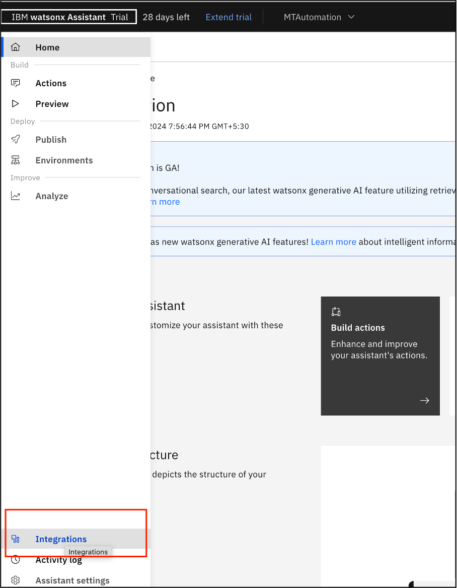

    3. Select "Build custom extension" from the Extensions section.

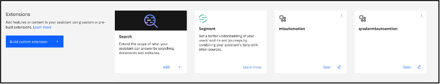

    4. Click "Next" to proceed.

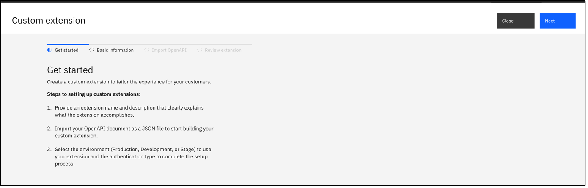

    5. Enter a name for your extension and provide a description if desired.

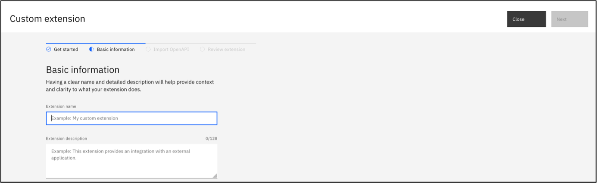

    6. Click "Next" to continue.
    7. In the Import OpenAPI section, click on "Drag and drop file here" or "Click to upload."

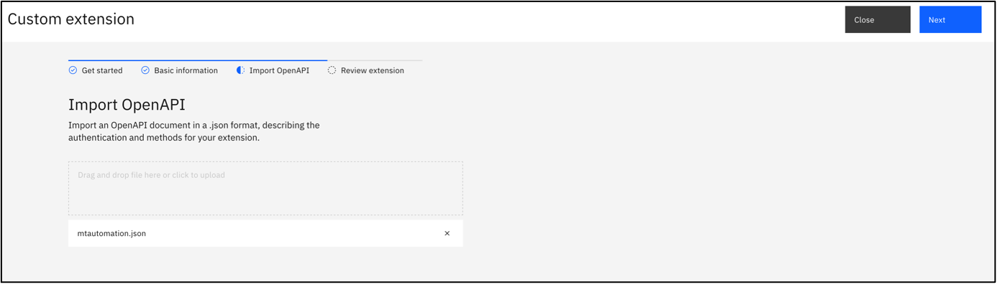

    8. Upload the CreatingTenant&Domain.json file you downloaded from GitHub.
    9. Click "Next" 
    10. On the Review page, verify your extension details and click "Finish."

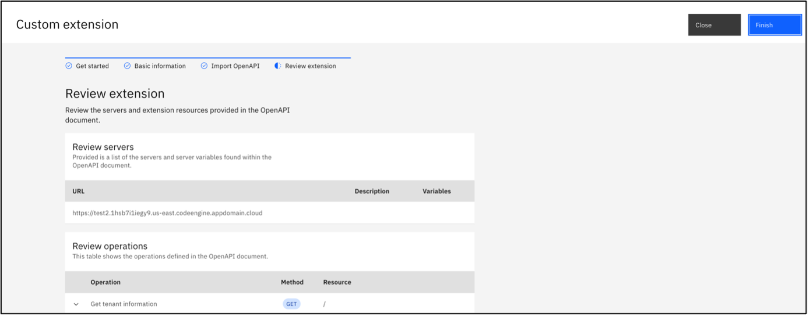

    11. Find your uploaded extension under the "Build Custom Extension" section.
    12. Click "Add", then click "Next

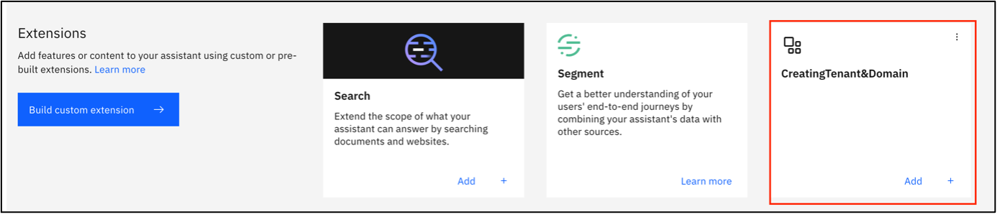 

    13. Keep the Authentication information as is and Click Next again.

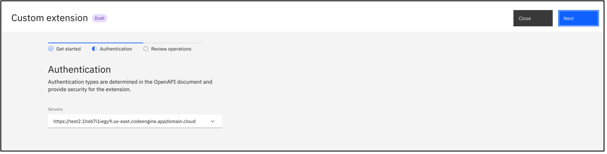 

    14. Click "Finish" to complete the import process.

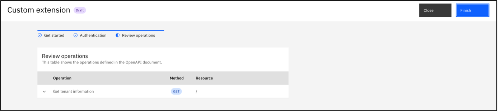 

    15. Repeat steps 1 through 12 for the second custom extension.
    16. Under Step 12 for the second extension’s Authentication settings, choose "API Key Auth" 
    and enter the token generated from the Authorized Service in the QRadar Console.

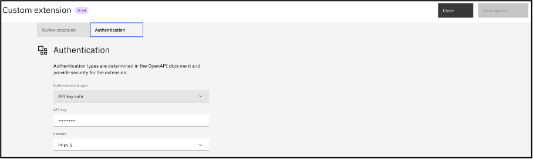 

## Importing Action Steps in Watsonx Assistant
    1. Go to the Action section within Watsonx Assistant.
    2. Click the Settings button located at the top right corner.

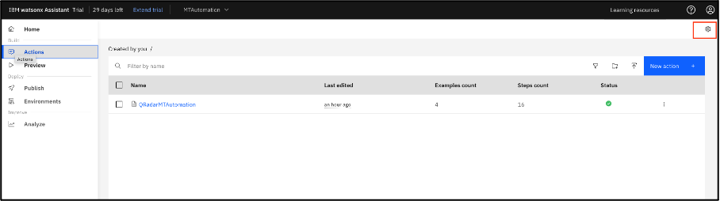

    3. Select "Upload/Download".
    4. Click on "Drag and drop file here" or "Click to select a file".

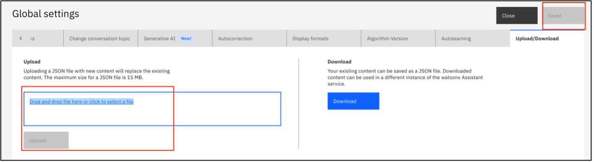

    5. Upload the QRadarMTConf-watonxAssistant-action.json file.
    6. Click "Save" to complete the upload.
    
After configuring the assistant. Update the script tag in QRadar app.

QRadar SDK documentation https://www.ibm.com/support/pages/qradar-whats-new-app-framework-sdk-v200

how to install QRadar SDK https://www.ibm.com/support/pages/qradar-whats-new-app-framework-sdk-v200#i

## To install the app on QRadar using the SDK, follow these simple steps:

Step1: Identify Default Server and User Values (Optional)
1. qapp server -q <QRadar_server> -u <QRadar_user>

Step2: Package the App
1. qapp package -p com.mycompany.myapp.zip

Step3: Deploy the App to QRadar
1. qapp deploy -q <QRadar_server> -u <QRadar_user> -p com.mycompany.myapp.zip

Note: “Replace <QRadar_server> with the IP or hostname of your QRadar console and <QRadar_user> with the username of a user with the necessary permissions to deploy apps. The app will be uploaded to QRadar and installed for use."

## Steps to deploy code on IBM Code Engine 

Step1: Login to ibm cloud from your terminal

Step2: Select the target group 
1. ibmcloud target -g `${target_group_name}`

Step3: Select the project created where you want to deploy the function 
1. ibmcloud ce project select -n `${project_name}`

Step4: Deploy the code-engine plugin in the terminal with the following command 
1. ibmcloud plugin install code-engine

Step5: To create the nodejs function in code engine
1. ibmcloud ce fn create --name `${function_name}` --runtime nodejs-18 --build-source .

Step6: To update the same function
1. ibmcloud ce fn update --name `${function_name}` --runtime nodejs-18 --build-source .

## Adding Environment Variables in IBM Code Engine

1.  Log in to IBM Cloud and access IBM Code Engine by clicking on the hamburger menu on the top left corner.

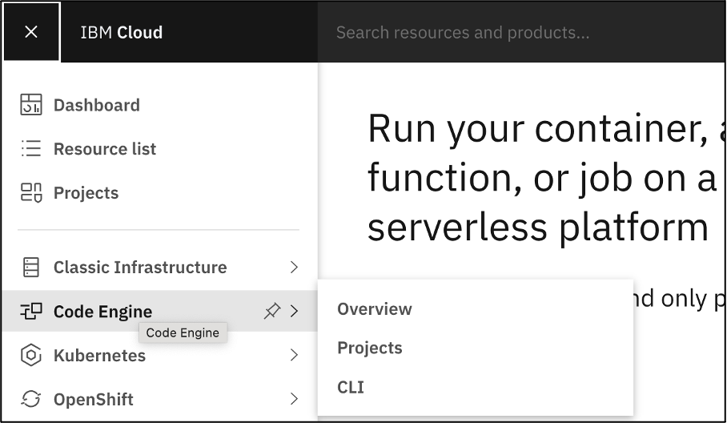

2.  In the left pane, click on the "Projects" option.

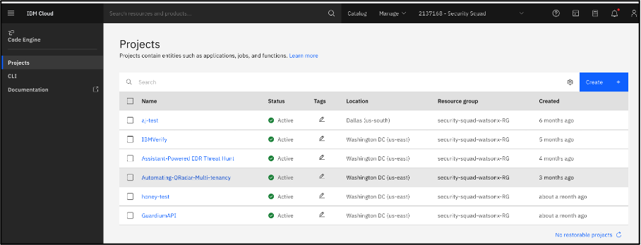

3.	Select your project from the list.
4.	Navigate to "Secrets and Configmaps."
5.	Click "Create" and choose "Configmap."

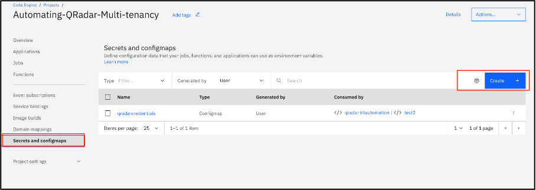

6.	Click "Next."

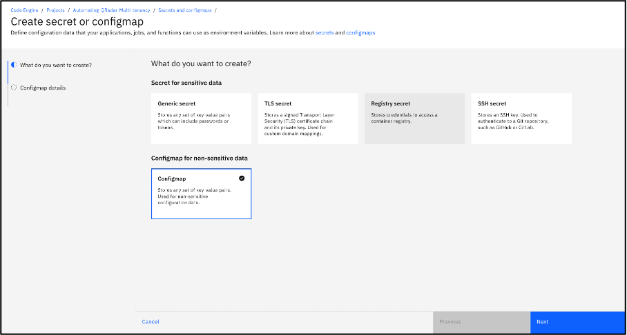

7.	Provide a Configmap name and click "Add key-value pair."
8.	Create two key-value pairs: one for API_IP and another for SEC_TOKEN.
9.	Click Create

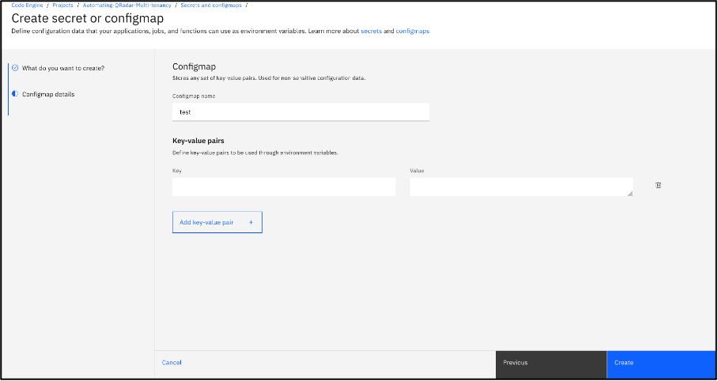

## Mapping Credentials to Your Function

1.	In the left pane, click on the "Function" section.
2.	Access the function you created.

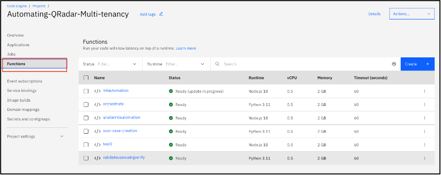

3.	Go to the "Environment Variables" tab.
4.	Click "Add Environment Variables."	

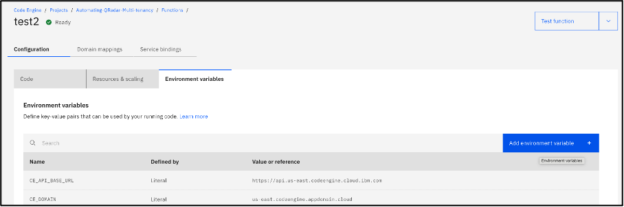

5.	To map the entire Configmap, select "Reference to full Configmap."
6.	To map only a specific key, choose "Reference to key in Secret."
7.	Click "Add."

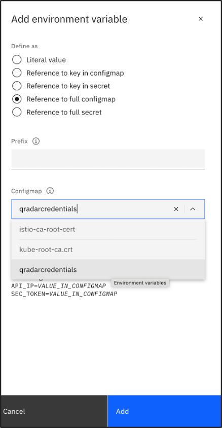

## List of Environment Variables in IBM Code Engine

1.	SEC_TOKEN
2.	API_IP
3.  HOST
4.  SSH_USERNAME
5.  SSH_PASSWORD

## Update in hello.html file in QRAdar APP app/template folder after your watsonx assistant is ready

1.	integrationID
2.	region
3.  serviceInstanceID

