# qradar-multitenant-app

The solution involves developing a chat assistant inside QRadar application that provides an administrative interface. This interface will allow administrators to input key elements such as tenants, associated domains, log sources, networks, security profiles, roles, and users. The goal is to streamline the creation of new tenants with a one-click process, ensuring an integrated and efficient approach.

This repo contains two main folder. 
    1.	multiTenantQradarApp contains the zip file for Qradar App that we can deploy on the QRadar instance.
    2.	multitenantConf-via-watsonxAssistant which has all the files that has been used in assistant for configuring the complete flow

# Importing Custom Extensions in Watsonx Assistant
    <strong> 1.	Log in to your Watsonx Assistant instance. <strong>
    2.  Navigate to the Integration section located at the bottom left corner.

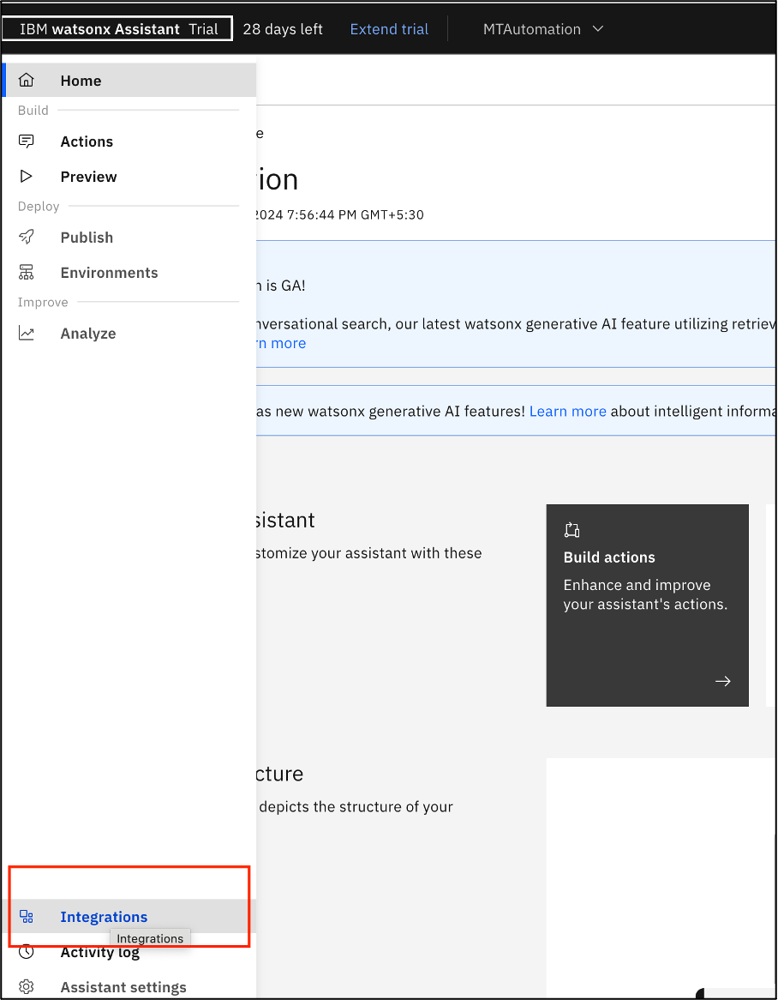

    3.	Select "Build custom extension" from the Extensions section.

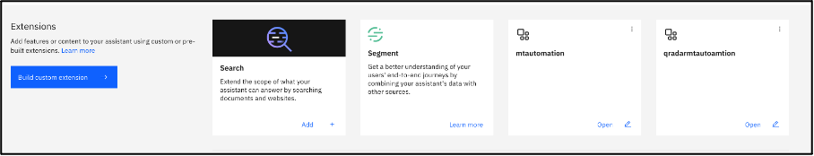

    4.	Click "Next" to proceed.

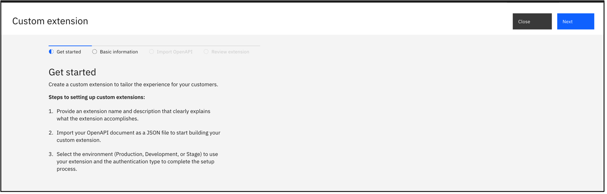

    5.	Enter a name for your extension and provide a description if desired.

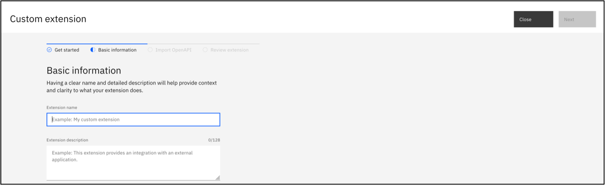

    6.	Click "Next" to continue.
    7.	In the Import OpenAPI section, click on "Drag and drop file here" or "Click to upload."

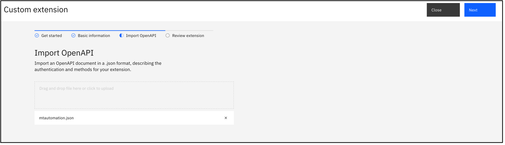

    8.	Upload the CreatingTenant&Domain.json file you downloaded from GitHub.
    9.	Click "Next" 
    10.	On the Review page, verify your extension details and click "Finish."

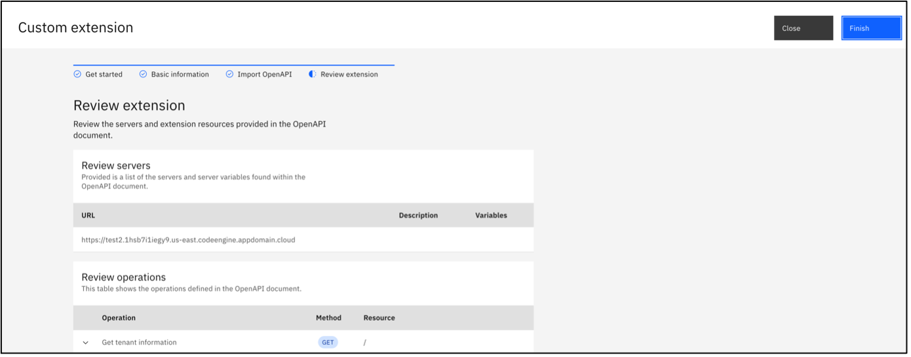

    11.	Find your uploaded extension under the "Build Custom Extension" section.
    12.	Click "Add", then click "Next

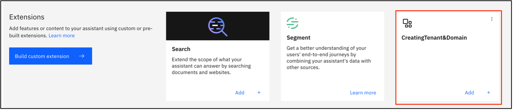 

    13.	Keep the Authentication information as is and Click Next again.

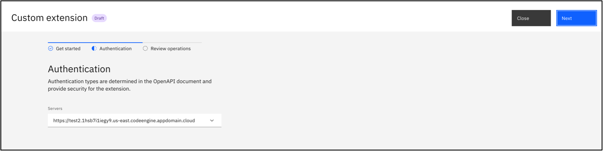 

    14.	Click "Finish" to complete the import process.

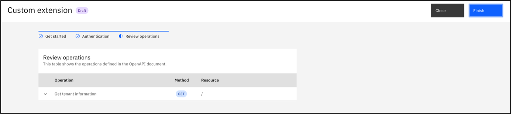 

    15.	Repeat steps 1 through 12 for the second custom extension.
    16.	Under Step 12 for the second extension’s Authentication settings, choose "API Key Auth" and enter the token generated from the Authorized Service in the QRadar Console.

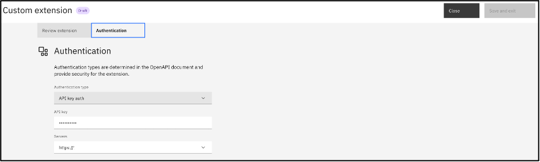 

# Importing Action Steps in Watsonx Assistant
    1.	Go to the Action section within Watsonx Assistant.
    2.	Click the Settings button located at the top right corner.

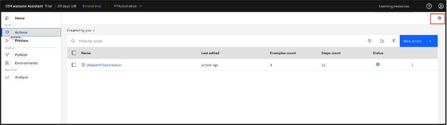

    3.	Select "Upload/Download".
    4.	Click on "Drag and drop file here" or "Click to select a file".

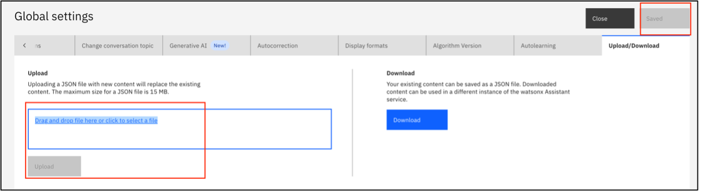

    5.	Upload the QRadarMTConf-watonxAssistant-action.json file.
    6.	Click "Save" to complete the upload.
    
After configuring the assistant. Update the script tag in qradar app.

QRadar SDK documentation https://www.ibm.com/support/pages/qradar-whats-new-app-framework-sdk-v200

how to install QRadar SDK https://www.ibm.com/support/pages/qradar-whats-new-app-framework-sdk-v200#i

# To install the app on QRadar using the SDK, follow these simple steps:

Step 1: Identify Default Server and User Values (Optional)
    qapp server -q <QRadar_server> -u <QRadar_user>

Step 2: Package the App
    qapp package -p com.mycompany.myapp.zip

Step 3: Deploy the App to QRadar
    qapp deploy -q <QRadar_server> -u <QRadar_user> -p com.mycompany.myapp.zip

Note: “Replace <QRadar_server> with the IP or hostname of your QRadar console and <QRadar_user> with the username of a user with the necessary permissions to deploy apps. The app will be uploaded to QRadar and installed for use."

